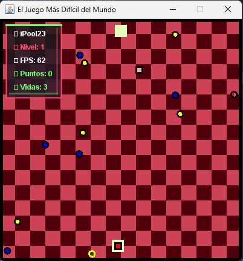
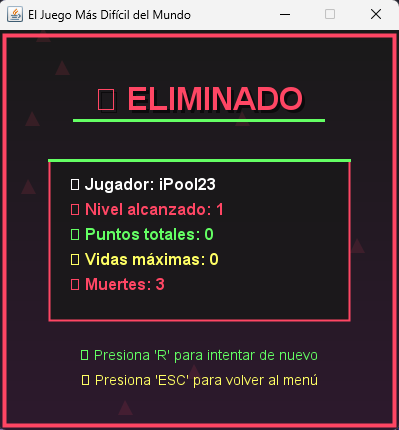

# El Juego Más Difícil del Mundo 🎮

Un juego de habilidad y supervivencia inspirado en el estilo visual de **Squid Game**, donde debes guiar un pequeño cuadrado a través de obstáculos peligrosos para alcanzar la meta.

## 🎯 Descripción

**El Juego Más Difícil del Mundo** es un juego de arcade desarrollado en Java que desafía tu destreza y paciencia. Controla un cuadrado que debe evitar obstáculos móviles, recolectar puntos y alcanzar la meta en cada nivel. Con un diseño minimalista inspirado en Squid Game, el juego presenta una paleta de colores distintiva con morado, rojo claro, verde y negro.

## 🎨 Características

- **Diseño Visual Único**: Interfaz inspirada en Squid Game con gradientes y elementos geométricos
- **20 Niveles Progresivos**: Cada nivel aumenta la dificultad con más obstáculos
- **Sistema de Vidas**: Gestiona tus vidas cuidadosamente para sobrevivir
- **Elementos Especiales**: 
  - 💎 Puntos para recolectar
  - ❤️ Corazones para ganar vidas extra
  - 🧲 Imanes que atraen todos los puntos
  - 🛡️ Escudos para invulnerabilidad temporal
- **Sistema de Logros**: Desbloquea logros por tu progreso
- **Múltiples Dificultades**: Fácil, Medio y Difícil
- **Efectos de Sonido**: Audio inmersivo para cada acción

## 🎮 Controles

| Tecla | Acción |
|-------|---------|
| `W` / `↑` | Mover arriba |
| `S` / `↓` | Mover abajo |
| `A` / `←` | Mover izquierda |
| `D` / `→` | Mover derecha |
| `P` | Pausar/Reanudar |
| `ESC` | Salir al menú |
| `R` | Reiniciar (en Game Over) |

## 📸 Capturas de Pantalla

### Panel de Inicio

*Menú principal con diseño inspirado en Squid Game*

### Gameplay

*Vista del juego mostrando obstáculos, puntos y elementos especiales*

### Panel de Estadísticas Finales

*Pantalla de Game Over o Victoria con estadísticas completas*

## 🚀 Cómo Ejecutar

### Prerrequisitos
- Java 8 o superior instalado
- Un entorno que soporte Swing (incluido en la mayoría de instalaciones de Java)

### Compilación y Ejecución

1. **Clonar o descargar el proyecto**
   ```bash
   git clone [url-del-repositorio]
   cd HardGame
   ```

2. **Compilar el proyecto**
   ```bash
   javac -d build/classes -cp src src/hardgame/*.java
   ```

3. **Ejecutar el juego**
   ```bash
   java -cp build/classes hardgame.Main
   ```

### Ejecución Directa
Si tienes un IDE como NetBeans, Eclipse o IntelliJ IDEA:
1. Abre el proyecto
2. Ejecuta la clase `Main.java`

## 🎲 Niveles de Dificultad

- **🟢 FÁCIL**: Velocidad reducida, ideal para principiantes
- **🟡 MEDIO**: Velocidad moderada con más desafíos
- **🔴 DIFÍCIL**: Velocidad máxima, solo para expertos

## 🏆 Sistema de Logros

- **Primer punto**: Recolecta tu primer punto
- **Diez puntos**: Alcanza 10 puntos
- **Cincuenta puntos**: Alcanza 50 puntos
- **Cien puntos**: Alcanza 100 puntos
- **Y más...**: Hasta 500 puntos
- **Nivel perfecto**: Completa un nivel sin perder vidas

## 🛠️ Tecnologías Utilizadas

- **Java**: Lenguaje de programación principal
- **Swing**: Framework para la interfaz gráfica
- **Java Sound API**: Para efectos de sonido
- **Graphics2D**: Para renderizado avanzado y efectos visuales

## 📋 Estructura del Proyecto

```
HardGame/
├── src/hardgame/
│   ├── Main.java           # Punto de entrada
│   ├── MenuPrincipal.java  # Menú principal
│   ├── GamePanel.java      # Panel principal del juego
│   ├── Square.java         # Jugador (cuadrado)
│   ├── Ball.java          # Obstáculos móviles
│   ├── Goal.java          # Meta del nivel
│   ├── Point.java         # Puntos recolectables
│   ├── Love.java          # Vidas extra
│   ├── Magnet.java        # Imán atrae-puntos
│   ├── Shield.java        # Escudo protector
│   ├── Logro.java         # Sistema de logros
│   └── sounds/            # Archivos de audio
├── build/                 # Archivos compilados
└── README.md             # Este archivo
```

## 🎵 Créditos de Audio

El juego incluye efectos de sonido para:
- Botones del menú
- Recolección de puntos
- Pérdida de vida
- Victoria de nivel
- Game Over
- Elementos especiales

## 🎮 Tips para Sobrevivir

1. **Paciencia es clave**: No te apresures, observa los patrones
2. **Usa los power-ups**: Los escudos y imanes pueden salvarte
3. **Gestiona tus vidas**: Cada vida cuenta
4. **Practica en fácil**: Domina los controles antes de aumentar la dificultad
5. **Observa los patrones**: Los obstáculos tienen movimientos predecibles

## 🚧 Desarrollo Futuro

Posibles mejoras futuras:
- Más tipos de obstáculos
- Niveles personalizables
- Tabla de puntuaciones online
- Más efectos visuales
- Modo multijugador
- Responsive

---

¿Estás listo para el desafío? ¡Demuestra que tienes lo necesario para ser un superviviente! 🏆
